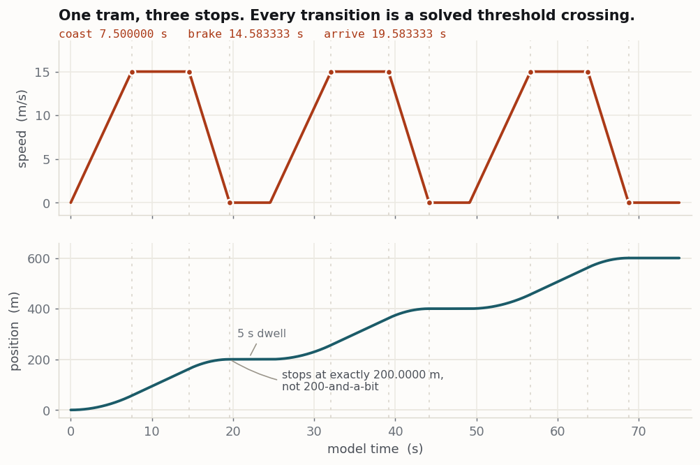
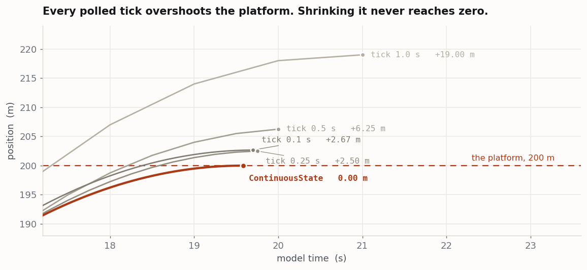
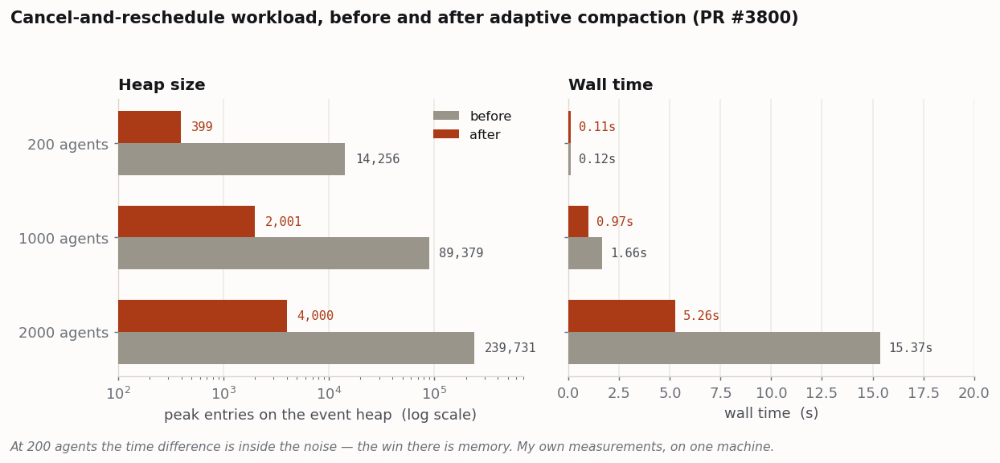
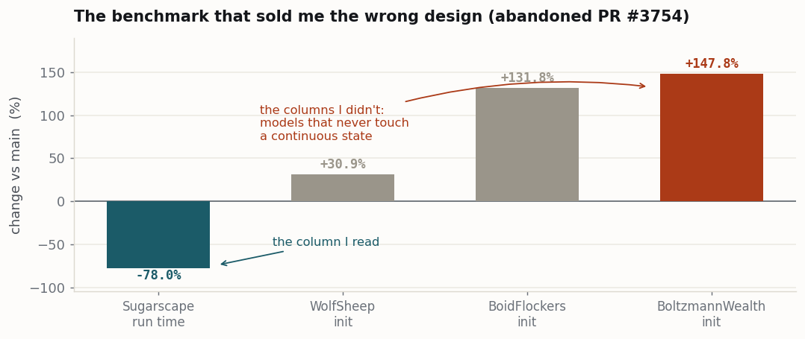

# Continuous-Time Agent State for Mesa

**Google Summer of Code 2026 — final work product**

| | |
|---|---|
| **Contributor** | Aman Bihari ([@codebreaker32](https://github.com/codebreaker32)) |
| **Organisation** | [Mesa](https://github.com/mesa/mesa) — agent-based modelling framework for Python |
| **Upstream repository** | `mesa/mesa` |
| **Primary deliverable** | `mesa.experimental.states` — `ContinuousState` and `Threshold` |
| **Also extends** | `mesa.experimental.actions` and the event list in `mesa.time` |
| **Status** | All pull requests merged |
| **Tracking issue** | [#3798](https://github.com/mesa/mesa/issues/3798) |

---

## 1. Summary

Mesa 4 advances simulated time through a single event list, but its modelling API required agents to be driven by a per-tick `step()` method. Quantities that vary continuously had to be re-integrated by hand on every tick, and every threshold condition had to be re-tested on every tick.

This project adds a declarative alternative. A quantity states its rate of change once; Mesa stores it as a trajectory and extrapolates it exactly on read. A `Threshold` solves in closed form for the time at which that trajectory reaches a limit and schedules a single event at that instant. Transition detection becomes exact rather than quantised to the tick grid, and its cost scales with the number of transitions rather than the number of ticks.

A second strand extends Mesa's existing `Action` primitive with preconditions, a failure state, priority-based preemption and an idle-wake hook. A third fixes the event-list growth that the threshold design exposes. All of it is merged and available on `main`.

---

## 2. Problem statement

### 2.1 The defect

Mesa 4 has no step counter. `Model.time` is a float and every state change, including the user's `step()`, is dispatched from one `EventList`. The engine is therefore event-scheduling based. The modelling API was not.

The following is `Animal.step` from Mesa's own wolf–sheep example, unchanged on `main`:

```python
def step(self):
    self.move()

    self.energy -= 1          # continuous decay, re-integrated by hand each tick

    self.feed()

    if self.energy < 0:       # threshold, re-tested each tick
        self.remove()
    elif self.random.random() < self.p_reproduce:
        self.spawn_offspring()
```

Two properties of this code are the subject of this project:

1. **The decay is manual and timestep-dependent.** `self.energy -= 1` is only the intended rate because the tick happens to be `1.0`. Changing the timestep silently changes the model's semantics.
2. **The threshold is polled.** The comparison executes once per agent per tick, and starvation can only be detected at a tick boundary — never at the instant it occurred. The engine was capable of scheduling that event exactly; no API exposed the capability.

### 2.2 Empirical basis

Before proposing new primitives, a baseline model was implemented in unmodified Mesa — a needs-based homeostatic agent with continuous state decay, priority-ordered decisions and spatial foraging — for the purpose of documenting the friction it produced. The findings were published as [discussion #3721](https://github.com/mesa/mesa/discussions/3721) and identified four failure modes: manual decay arithmetic, polled thresholds, positional rather than declarative priority, and the impossibility of expressing a durative interruptible task without hand-rolled state.

Maintainer Jan Kwakkel supplied the framing the project was subsequently built around:

> Event scheduling … provides a locality of time. Activity scanning … provides a locality of state. Process interaction … provides a locality of object. Mesa 4 is event scheduling based, defaulting to incremental time advancement.

The diagnosis follows: Mesa's engine implements event scheduling while its modelling API required activity scanning to be written on top of it.

### 2.3 Prior art

The problem was not identified by this project. Ewout ter Hoeven opened three discussions on it in December 2024 — [Tasks](https://github.com/mesa/mesa/discussions/2526), [Continuous States](https://github.com/mesa/mesa/discussions/2529) and [Behavioral Framework](https://github.com/mesa/mesa/discussions/2538) — and contributed the `Action` primitive in [#3461](https://github.com/mesa/mesa/pull/3461). This project contributes the empirical baseline, the continuous-state implementation, and the extensions to `Action` described in §4.3.

---

## 3. Design

The implementation is built entirely on primitives Mesa already possessed: the reactive observables in `mesa.experimental.mesa_signals`, and the event list in `mesa.time`. No scheduler is introduced and no per-model allocation is added; §8.1 records the rejected design that did both.

```
 declaration                trajectory store            analytic solver           event list           callback
 ───────────                ────────────────            ───────────────           ──────────           ────────
 speed = ContinuousState(   base_value                  0.5at² + vt + (x₀−L) = 0  binary heap          agent.brake()
     rate=lambda a:  ────►  last_time          ────►    filter roots by v(t)  ──► one event   ────►    agent.on_idle()
         a.acceleration)    current_rate                → crossing time t*        per threshold
 Threshold(speed, 15.0,     second_order_rate
     "start_coasting")
                                  ▲                                                                        │
                                  └──────────── the callback assigns a new rate or limit ───────────────────┘
                                     the trajectory is re-baselined, the solver re-runs,
                                     the old event is cancelled, one replacement is scheduled
```

The feedback edge is the substance of the design. A threshold's projected crossing time is a derived value, not a one-time registration: changing an acceleration or moving a limit causes the solver to re-run and the scheduled event to be replaced. This is also what makes the event list churn, which §5.6 addresses.

---

## 4. API

### 4.1 `ContinuousState`

```python
from mesa.experimental.states import ContinuousState

class ContinuousState(BaseObservable):
    def __init__(
        self,
        fallback_value: float = 0.0,
        rate: float | Callable[[Any], float] = 0.0,
    ) -> None: ...
```

A descriptor that stores a value as a trajectory rather than a scalar. Per instance it holds `base_value`, `last_time`, `current_rate` and `second_order_rate`. Reading the attribute extrapolates to the current model time:

```
value(t) = base_value + current_rate·Δt + 0.5·second_order_rate·Δt²
```

`rate` is either a constant or a callable `f(agent) -> float` evaluated through the `mesa_signals` dependency-diffing engine, so it recomputes when its inputs change. When a rate changes, the current value is snapshotted using the *previous* rate and committed as the new baseline, keeping the trajectory continuous across the transition rather than discontinuous.

Declaring a state auto-generates a shadow `{name}_rate` observable. A `__set_name__` guard raises `AttributeError` on a namespace collision, checked against both `__dict__` and `__slots__`.

**Usage.**

```python
from mesa import Agent
from mesa.experimental.mesa_signals import HasEmitters, Observable
from mesa.experimental.states import ContinuousState


class Reservoir(Agent, HasEmitters):
    inflow  = Observable(fallback_value=0.0)
    outflow = Observable(fallback_value=0.0)

    # constant rate
    sediment = ContinuousState(fallback_value=0.0, rate=0.02)

    # callable rate, recomputed whenever inflow or outflow changes
    volume = ContinuousState(fallback_value=500.0,
                             rate=lambda a: a.inflow - a.outflow)


r = Reservoir(model)
r.inflow, r.outflow = 3.0, 1.0

model.run_until(10.0)
r.volume        # 520.0  — extrapolated, never stored per tick
r.volume_rate   # 2.0    — the auto-generated shadow observable

r.outflow = 5.0          # rate becomes -2.0; 520.0 is committed as the new baseline
model.run_until(15.0)
r.volume        # 510.0  — continuous across the rate change, not discontinuous
```

Chaining is implicit: if a state's rate resolves to another `ContinuousState`, the second-order term is discovered from the recorded dependencies and the extrapolation becomes quadratic.

```python
class Vehicle(Agent, HasEmitters):
    acceleration = Observable(fallback_value=0.0)
    speed    = ContinuousState(rate=lambda a: a.acceleration)   # first order
    position = ContinuousState(rate=lambda a: a.speed)          # second order
```

### 4.2 `Threshold`

```python
from mesa.experimental.states import Threshold

class Threshold:
    def __init__(
        self,
        state: ContinuousState,
        limit: float | Observable,
        callback: str,
        direction: str = "crossing",   # "rising" | "falling" | "crossing"
    ) -> None: ...
```

A class-level descriptor that fires a named agent method when `state` reaches `limit`. `limit` may be a fixed float **or** an `Observable` on the agent; in the latter case `bind()` subscribes to the limit's `CHANGED` signal as well as the state's, so a per-instance runtime target is set by plain assignment and re-solves itself.

Binding is lazy. The first `ContinuousState` access on an instance walks the MRO for `_continuous_thresholds` and wires up every threshold found. There is no registration step and no scheduler to attach to.

Each threshold owns at most one live entry on the model's event list, cancelling and rescheduling as the trajectory changes. A trajectory that never reaches the limit cancels the event and parks the projected time at `math.inf`.

**Usage.**

```python
from mesa.experimental.states import ContinuousState, Threshold


class Sheep(Agent, HasEmitters):
    energy   = ContinuousState(fallback_value=100.0, rate=-1.0)
    starving = Observable(fallback_value=20.0)      # a per-instance limit

    # fixed limit: the same for every sheep
    _death = Threshold(state=energy, limit=0.0,
                       callback="die", direction="falling")

    # Observable limit: assigning to self.starving re-solves this threshold
    _hungry = Threshold(state=energy, limit=starving,
                        callback="seek_food", direction="falling")

    def die(self):
        self.remove()

    def seek_food(self):
        self.start_action(Forage(self))


sheep = Sheep(model)
sheep.starving = 35.0     # re-solves _hungry; no rearm() call exists
```

`direction` selects which crossings count:

| `direction` | Fires when |
|---|---|
| `"rising"` | the value is increasing at the crossing |
| `"falling"` | the value is decreasing at the crossing |
| `"crossing"` | either, but not a tangent touch (zero velocity at the root) |

### 4.3 `Action` extensions

The `Action` class and its four-state lifecycle are pre-existing work by Ewout ter Hoeven ([#3461](https://github.com/mesa/mesa/pull/3461)). The parameters and states marked `# added` below were contributed by this project.

```python
from mesa.experimental.actions import Action, ActionState

class Action:
    def __init__(
        self,
        agent: Agent,
        duration: float | Callable[[Agent], float] = 1.0,
        *,
        name: str | None = None,
        priority: float | Callable[[Agent], float] = 0.0,
        interruptible: bool = True,
        start_requirements: Callable[[Agent], bool]              # added
        | Iterable[Callable[[Agent], bool]]
        | None = None,
        completion_requirements: Callable[[Agent], bool]         # added
        | Iterable[Callable[[Agent], bool]]
        | None = None,
    ) -> None: ...

class ActionState(IntEnum):
    PENDING     = auto()
    ACTIVE      = auto()
    COMPLETED   = auto()
    INTERRUPTED = auto()
    FAILED      = auto()   # added
```

Both requirement parameters accept a single predicate or an iterable of them, mirroring how `duration` and `priority` already accept callables resolved against the agent. Subclasses may assign to either list after `super().__init__()`.

- `start_requirements` is evaluated in `start()` **before** duration and priority are resolved. A failing predicate moves the action to `FAILED` and fires `on_fail()`; no `on_start()` runs and no completion event is scheduled.
- `completion_requirements` is evaluated in `_do_complete()` before the effect is applied, and is empty by default. On failure `progress` still reads `1.0`, because the full duration did elapse; only the effect is withheld.

**Usage.**

```python
from mesa.experimental.actions import Action, ActionState


class Forage(Action):
    def __init__(self, sheep, patch):
        super().__init__(
            sheep,
            duration=lambda a: 5.0 / a.speed,        # callable, resolved at start()
            priority=1.0,
            start_requirements=lambda a: patch.grass > 0,
            completion_requirements=lambda a: a.alive,
        )
        self.patch = patch

    def on_start(self):    self.patch.grass -= 1
    def on_complete(self): self.agent.energy += 20
    def on_fail(self):     self.agent.wander()


action = sheep.start_action(Forage(sheep, patch))

action.state          # ActionState.ACTIVE, or FAILED if the grass was gone
action.progress       # 0.0 -> 1.0, computed live from model.time
action.remaining_time
action.has_failed
```

### 4.4 `Agent` hooks

```python
class Agent:
    # pre-existing
    def start_action(self, action: Action) -> Action: ...
    def interrupt_for(self, new_action: Action) -> bool: ...
    def cancel_action(self) -> bool: ...
    @property
    def is_busy(self) -> bool: ...

    # added by this project
    def should_interrupt(self, current: Action, incoming: Action) -> bool:
        """Consulted by interrupt_for() whenever the agent is busy."""
        return current.interruptible and incoming.priority >= current.priority

    def on_idle(self, previous: Action | None) -> None:
        """Called when an action has ended and nothing replaced it. Default: no-op."""
```

### 4.5 `HasEmitters.peek`

```python
value = model.peek("time", 0.0)   # read an Observable without registering a dependency
```

Added in [#3774](https://github.com/mesa/mesa/pull/3774). Its necessity is explained in §5.3.

### 4.6 A complete minimal model

The smallest model that exercises both wake sources. A kettle heats at a constant rate, a threshold fires when it boils, and the agent starts a timed action in response; when that action ends, `on_idle` decides what happens next.

```python
from mesa import Agent, Model
from mesa.experimental.actions import Action
from mesa.experimental.mesa_signals import HasEmitters, Observable
from mesa.experimental.states import ContinuousState, Threshold


class Steep(Action):
    def __init__(self, agent):
        super().__init__(agent, duration=180.0)      # three minutes

    def on_complete(self):
        self.agent.cups_made += 1


class Kettle(Agent, HasEmitters):
    power       = Observable(fallback_value=0.0)
    temperature = ContinuousState(fallback_value=20.0, rate=lambda a: a.power)

    _boiled = Threshold(state=temperature, limit=100.0,
                        callback="boiled", direction="rising")

    def __init__(self, model):
        super().__init__(model)
        self.cups_made = 0
        self.power = 0.0
        self.temperature = 20.0

    def switch_on(self):
        self.power = 0.5                 # degrees per second

    def boiled(self):                    # wake source 1: the world crossed a line
        self.power = 0.0
        self.start_action(Steep(self))

    def on_idle(self, previous):         # wake source 2: the body became free
        if self.cups_made < 3:
            self.temperature = 20.0      # fresh water
            self.switch_on()


class Kitchen(Model):
    def __init__(self):
        super().__init__()
        self.kettle = Kettle(self)
        self.schedule_event(self.kettle.switch_on, at=0.0)


model = Kitchen()
model.run_until(2000.0)
model.kettle.cups_made        # 3
```

The kettle has no `step()`. Between `switch_on()` and `boiled()` the model holds exactly one scheduled event, and `temperature` is correct if read at any instant in between — it is never sampled.

> **Note.** Everything in this example is merged and available on `main`. `on_idle` landed in [#3833](https://github.com/mesa/mesa/pull/3833) on 7 September 2026.

---

## 5. Implementation

### 5.1 Crossing times are solved, not sampled

Because the trajectory is known in closed form, the time at which it reaches a limit is a polynomial root. A constant-rate state gives a linear solve; a state chained off another `ContinuousState` — position off speed, while speed itself changes under acceleration — gives a quadratic.

```python
# mesa/experimental/states/state.py — Threshold.recalculate
if a == 0.0:
    # Pure linear case
    if v != 0.0:
        t = (limit - current_value) / v
        if t >= 0.0:
            valid_times.append((t, v))
else:
    # Quadratic case: 0.5*a*t^2 + v*t + (x0 - limit) = 0
    qa, qb, qc = 0.5 * a, v, current_value - limit
    discriminant = qb**2 - 4 * qa * qc

    # Allow microscopic negative discriminants from float error near tangent touches
    if discriminant >= -np.finfo(float).eps:
        sqrt_disc = math.sqrt(max(0.0, discriminant))
        for t in ((-qb - sqrt_disc) / (2 * qa), (-qb + sqrt_disc) / (2 * qa)):
            if t >= -np.finfo(float).eps:
                t_clean = max(0.0, t)
                # Velocity at the moment of intersection, not the velocity now
                valid_times.append((t_clean, qb + a * t_clean))
```

The tolerance is `np.finfo(float).eps` rather than a hand-chosen constant, at a reviewer's suggestion.

### 5.2 Direction filtering and edge cases

`direction` is enforced against the velocity **at the root**, `v + a·t`, not against the velocity at the time of the solve:

```python
for t, v_cross in valid_times:
    if self.direction == "rising"  and v_cross <= 0: continue
    if self.direction == "falling" and v_cross >= 0: continue
    if self.direction == "crossing" and v_cross == 0:
        continue   # tangent touches bounce away rather than crossing
```

A parabola that grazes the limit and turns back has zero velocity at the touch point, so a `"crossing"` threshold correctly declines to fire — nothing crossed. Comparing against the current velocity would fire on every tangent touch.

A second case is a zero-time root while the state already sits on the limit. This arises mid-callback: `brake()` assigns a new acceleration while `position == brake_point`, the assignment triggers a re-solve, and `t = 0` is a legitimate root. Scheduling at `model.time + 0` would re-fire the same threshold immediately and without bound. Such roots are rejected, with a tolerance scaled to the magnitude of the limit rather than fixed.

Further cases handled in code: assignment inside a computed context raises on cyclical dependencies; an init-ordering race, in which a rate lambda reads an observable whose backing store does not yet exist mid-`Agent.__init__`, is narrowly detected and treated as at rest, while genuine errors in the rate lambda still raise.

### 5.3 Reading model time without subscribing to it

An early revision read `model._time` directly. The public attribute could not be substituted naively: `model.time` is itself an `Observable`, so reading it inside a rate evaluation registers the clock as a dependency of *every* trajectory. Every tick would then re-snapshot every state, decomposing each parabola into a sequence of microscopic linear segments and destroying the exactness the design exists to provide.

The resolution was a public non-reactive read, `HasEmitters.peek()`, split out as [#3774](https://github.com/mesa/mesa/pull/3774). [#3764](https://github.com/mesa/mesa/pull/3764) extracted `ComputedState.evaluate()` so the rate machinery had a supported entry point. Both were merged before the main pull request.

### 5.4 Declarative limits

An earlier API required imperative re-arming:

```python
# rejected during review
Tram._brake_point.set_limit(self, brake_at)
Tram._cruise.rearm(self)
Tram._stop.rearm(self)
```

Permitting `limit` to be an `Observable`, and having `bind()` subscribe to that observable's `CHANGED` signal, reduced the above to a single assignment:

```python
self.brake_point = self.next_station - self.braking_distance()
```

This removed `set_limit()`, `rearm()`, `_get_limit()`, `limit_attr` and `fired_attr` from the public surface, and with them the failure mode in which a model omits a re-arm call and the threshold silently never fires again.

### 5.5 Action lifecycle

```
                    start_requirements fail
        PENDING ─────────────────────────────► FAILED ◄──── completion_requirements fail
           │                                      ▲
           │ start()                              │
           ▼                                      │
        ACTIVE ──── completion event fires ───────┴──────► COMPLETED
           │  ▲
 interrupt │  │ start() resumes
   cancel  ▼  │
      INTERRUPTED

  COMPLETED, FAILED and INTERRUPTED all pass through Action._release_agent(),
  which clears agent.current_action and schedules a zero-delay Priority.LOW
  event that invokes Agent.on_idle(previous).

  interrupt_for() consults Agent.should_interrupt(current, incoming) first.
```

Two independent requirement lists are provided rather than one list tested twice, because they answer different questions. A contended resource should be *claimed* at the start, and the agent's response to a failed claim — take what remains, go elsewhere, wait — is behaviour rather than a boolean gate. The completion list is for conditions that cannot be reserved: a market still open when a trade settles, a counterparty still solvent at settlement.

Neither list is re-evaluated in between. Continuous revalidation would require rescanning every active action whenever the world changes, which reintroduces activity scanning. An action that must abort the moment a condition breaks is expressed as a `Threshold` invoking `cancel_action()`.

```python
class Graze(Action):
    def __init__(self, sheep, patch):
        super().__init__(sheep, duration=3.0,
                         start_requirements=lambda a: patch.servings > 0)
        self.patch = patch

    def on_start(self):
        self.patch.servings -= 1        # claimed; nobody else can take it

    def on_complete(self):
        self.agent.energy += 30

    def on_fail(self):
        self.agent.energy -= 2          # walked there for nothing
        self.agent.look_elsewhere()


# A condition nobody can reserve, gating the effect rather than the attempt
Trade(trader, duration=5.0, completion_requirements=lambda a: market.open)
```

`Action.priority` was resolved at `start()` and read by nothing prior to [#3805](https://github.com/mesa/mesa/pull/3805); `git grep` on `main` found two occurrences, both writes. `should_interrupt` gives it effect:

```python
class Sheep(Agent):
    def should_interrupt(self, current, incoming):
        if current.name == "Flee":
            return False                       # never stop fleeing, at any priority
        return super().should_interrupt(current, incoming)


sheep.start_action(Forage(sheep, priority=1.0))
sheep.interrupt_for(Flee(sheep, priority=10.0))     # True — forage interrupted
sheep.interrupt_for(Forage(sheep, priority=1.0))    # False — flee continues
```

The default comparison is `>=` rather than `>`. Priorities default to `0.0`, so a strict `>` would silently prevent every existing model from interrupting at all; it broke three tests already present on `main`. With `>=` the hook is a no-op for any model written before it.

`on_idle` is dispatched as a zero-delay `Priority.LOW` event rather than called synchronously from `_do_complete`. This ensures a zero-duration action started from within `on_idle` cannot recurse, and that every agent finishing at time *t* decides only after all completions at *t* have run. At most one wake is delivered per agent per model time; endings that coalesce report the latest as `previous`, and a suppressed repeat is logged at `DEBUG` rather than silently dropped. `Agent.remove()` cancels a pending wake, so a removed agent never wakes.

```python
class Worker(Agent):
    def on_idle(self, previous):
        self.start_action(Task(self, duration=1.0))
```

A known sharp edge, documented rather than hidden: a requirement that fails on **resume** is terminal. The action retains its partial progress and cannot be restarted. Returning it to `INTERRUPTED` instead would require `start()` to accept `FAILED`, which would misclassify the resume path.

### 5.6 Event-list compaction

Solving crossings analytically requires re-solving whenever a trajectory changes, and every re-solve cancels an event. Mesa cancels using the tombstone pattern: the cancelled event remains on the heap to preserve the heap invariant and is discarded when it surfaces. A threshold whose projected time moves repeatedly therefore grows the heap without bound. On a cancel-and-reschedule workload with 2000 agents over 800 steps, the heap peaked at 239,731 entries, of which 99.2% were tombstones.

An `EventList.compact()` method had existed since [#3359](https://github.com/mesa/mesa/pull/3359), authored by souro26, and a comment in `remove()` described cancelled events as something that "may trigger adaptive compaction if they dominate the heap". No caller existed, and the merged diff contained neither a counter nor a trigger.

[#3800](https://github.com/mesa/mesa/pull/3800) supplies both:

```python
class EventList:
    COMPACTION_RATIO: float = 0.25    # bounds the peak heap at L / (1 - RATIO)

    def _on_cancellation(self) -> None:
        self._n_canceled += 1
        if self._n_canceled > len(self._events) * self.COMPACTION_RATIO:
            self.compact()

    def __len__(self) -> int:
        return len(self._events) - self._n_canceled     # O(1), was a full scan
```

The check hangs off `cancel()` rather than `add_event` or `pop_event` because cancellation is the only operation that *adds* dead weight, and therefore the only point at which a heap can newly exceed the threshold. Placing it in `pop_event` — the position proposed by the original design sketch — pays the cost on the hot path.

Tracking the count requires a back-reference from each event to its list, because `Event.cancel()` is invoked directly on the event by `Action`, `Threshold` and `EventGenerator` and never routes through the list. The reference is **weak**, set in `add_event` and cleared on pop: an event that has left the heap must not be counted against it, and events must not keep a dead list alive.

`is_empty()` and `peek_ahead()` inherit the O(1) length.

The ratio was selected by measurement. An initial value of 0.5 was replaced with 0.25 after a sweep over an 800-agent workload, posted in the review thread. The same sweep showed that a `COMPACTION_FLOOR` constant earned nothing above roughly 192 live events, and it was removed.

**Stated precisely:** popping a *live* event also raises the instantaneous ratio, since it shrinks the heap without removing a tombstone, so the heap can sit above the ratio between cancellations. The guarantee provided is a bound on accumulated dead weight — tombstones arise only at cancellation, and every cancellation is checked — not that the ratio is never momentarily exceeded. This is sufficient for the memory bound the workload requires.

---

## 6. Worked example: the tram route model

Added in [#3796](https://github.com/mesa/mesa/pull/3796). A single tram runs an ordered route of stations. On departure it accelerates at a fixed rate; on reaching cruise speed it coasts; at an analytically computed brake point it decelerates; on reaching zero speed it has arrived, dwells, and departs for the next station. **Every one of those transitions is a threshold crossing, and the agent defines no `step()` method.**

### 6.1 Agent

```python
# mesa/examples/experimental/tram_model/agents.py
import math

from mesa import Agent, Model
from mesa.experimental.mesa_signals import HasEmitters, Observable
from mesa.experimental.states import ContinuousState, Threshold


class Tram(Agent, HasEmitters):
    acceleration = Observable(fallback_value=0.0)
    speed        = ContinuousState(fallback_value=0.0, rate=lambda a: a.acceleration)
    position     = ContinuousState(fallback_value=0.0, rate=lambda a: a.speed)
    brake_point  = Observable(fallback_value=float("inf"))
    cruise_speed = Observable(fallback_value=15.0)

    # Threshold names must not collide with the private backing attribute of any
    # Observable they read: a Threshold called _brake_point would be found by the
    # lookup of brake_point's own "_brake_point" store and silently shadow it.
    _cruise_threshold = Threshold(
        state=speed, limit=cruise_speed, callback="start_coasting", direction="rising"
    )
    _braking_threshold = Threshold(
        state=position, limit=brake_point, callback="brake", direction="rising"
    )
    _stop_threshold = Threshold(
        state=speed, limit=0.0, callback="arrive_at_station", direction="falling"
    )

    def __init__(self, model, route, cruise_speed=15.0, acceleration_rate=2.0,
                 deceleration_rate=3.0, dwell_time=5.0):
        super().__init__(model)
        if len(route) < 2:
            raise ValueError("route must contain at least a start and one destination")

        self.route = route
        self.acceleration_rate = acceleration_rate
        self.deceleration_rate = deceleration_rate
        self.dwell_time = dwell_time
        self._segment_index = 1

        # The limits the thresholds read must exist before the first
        # ContinuousState assignment, which is what binds the thresholds.
        self.brake_point = float("inf")
        self.cruise_speed = cruise_speed

        self.acceleration = 0.0
        self.speed = 0.0
        self.position = route[0]

    @property
    def next_station(self) -> float:
        return self.route[self._segment_index]

    @property
    def route_complete(self) -> bool:
        return self._segment_index >= len(self.route)

    def peak_speed(self) -> float:
        """Highest speed reachable before braking must begin.

        On a long segment this is the cruise speed. On a short one the tram runs
        out of room first and the profile is triangular: it accelerates to
        v = sqrt(2d / (1/a + 1/b)) and brakes from there, never coasting.
        """
        distance = self.next_station - self.position
        triangular = math.sqrt(
            2.0 * distance
            / (1.0 / self.acceleration_rate + 1.0 / self.deceleration_rate)
        )
        return min(self.cruise_speed, triangular)

    def braking_distance(self) -> float:
        return self.peak_speed() ** 2 / (2.0 * self.deceleration_rate)

    # ---- threshold callbacks -------------------------------------------
    def depart(self) -> None:
        self.brake_point = self.next_station - self.braking_distance()
        self.acceleration = self.acceleration_rate

    def start_coasting(self) -> None:
        self.acceleration = 0.0

    def brake(self) -> None:
        self.brake_point = float("inf")
        self.acceleration = -self.deceleration_rate

    def arrive_at_station(self) -> None:
        self.acceleration = 0.0
        self._segment_index += 1
        if self.route_complete:
            return
        self.model.schedule_event(self.depart, after=self.dwell_time)
```

Assigning to `brake_point` in `depart()` is sufficient to re-solve `_braking_threshold`; no re-arming call exists. The brake point is derived from the segment's **peak** speed rather than the cruise speed, because on a short segment the tram never reaches cruise: assuming otherwise places the brake point outside the segment, and a rising threshold that begins already past its limit never fires at all.

### 6.2 Model

```python
# mesa/examples/experimental/tram_model/model.py
class TramScenario(Scenario):
    n_stations: int = 20
    station_spacing: float = 200.0
    cruise_speed: float = 15.0
    acceleration_rate: float = 2.0
    deceleration_rate: float = 3.0
    dwell_time: float = 5.0


class TransitSystem(Model):
    def __init__(self, scenario: TramScenario = TramScenario):
        super().__init__(scenario=scenario)

        self.route = [scenario.station_spacing * i
                      for i in range(int(scenario.n_stations))]

        self.tram = Tram(self, route=self.route,
                         cruise_speed=scenario.cruise_speed,
                         acceleration_rate=scenario.acceleration_rate,
                         deceleration_rate=scenario.deceleration_rate,
                         dwell_time=scenario.dwell_time)

        self.recorder = DataRecorder(self)
        self.data_registry.track_agents(
            self.agents, "tram_data", ["position", "speed", "acceleration"]
        ).record(self.recorder)

        # The tram is idle until told to leave the first station. Scheduling the
        # departure rather than calling it directly keeps every state change on
        # the event queue, so model.time is meaningful from the very first entry.
        self.schedule_event(self.tram.depart, at=0.0)

    def step(self) -> None:
        """Sample the tram's continuous states once per time unit.

        The tram needs no per-step logic: its speed and position are extrapolated
        analytically and its transitions fire from the event queue. This exists
        purely to feed the DataCollector behind the plots.
        """
        self.datacollector.collect(self)
```

Deleting `TransitSystem.step` produces byte-identical arrival times. It samples for the plots; it does not drive the model.

### 6.3 Running it

```console
$ pip install "mesa[rec]"
$ solara run mesa/examples/experimental/tram_model/app.py   # interactive
$ python mesa/examples/experimental/tram_model/model.py     # trace to stdout
```

### 6.4 Output



With `cruise_speed=15.0`, `acceleration_rate=2.0`, `deceleration_rate=3.0` and 200 m spacing, the first segment produces:

| Event | Model time | Position | Speed |
|---|---:|---:|---:|
| `depart` | 0.000000 s | 0.0000 m | 0.0000 m/s |
| `start_coasting` | 7.500000 s | 56.2500 m | 15.0000 m/s |
| `brake` | 14.583333 s | 162.5000 m | 15.0000 m/s |
| `arrive_at_station` | 19.583333 s | 200.0000 m | 0.0000 m/s |

The arrival time is 175/12 — a value no integer tick grid contains. These figures are asserted exactly in `tests/experimental/test_states.py::TestDemoIntegration::test_demo_scenario_end_to_end`.

---

## 7. Evaluation

### 7.1 Exactness against a polling loop

The comparison below integrates the same segment with a forward-Euler loop that polls its thresholds every tick — the construction this API replaces. That loop is implemented in [`make_figures.py`](make_figures.py) in this repository; it is not part of Mesa and is not a Mesa benchmark. It is included so the figures are reproducible.



| Method | Arrival detected | Time error | Stopping position | Position error |
|---|---:|---:|---:|---:|
| Polling, 1.0 s tick | 21.000 s | +1.417 s | 219.0000 m | **+19.00 m** |
| Polling, 0.5 s tick | 20.000 s | +0.417 s | 206.2500 m | +6.25 m |
| Polling, 0.25 s tick | 19.750 s | +0.167 s | 202.5000 m | +2.50 m |
| Polling, 0.1 s tick | 19.700 s | +0.117 s | 202.6700 m | +2.67 m |
| `ContinuousState` + `Threshold` | 19.583333 s | — | 200.0000 m | **0.00 m** |

Reducing the tick incurs linear additional work and does not converge to zero error. The 0.1 s row is worse than the 0.25 s row, error accumulation not being monotonic in step size.

### 7.2 Event-list compaction



| Workload | Wall time before | after | Peak heap before | after |
|---|---:|---:|---:|---:|
| 200 agents | 0.12 s | 0.11 s | 14,256 | 399 |
| 1000 agents | 1.66 s | 0.97 s | 89,379 | 2,001 |
| 2000 agents | 15.37 s | 5.26 s | 239,731 | 4,000 |

Peak memory at 1000 agents falls from 29.0 MB to 1.3 MB. `len()` on a 50,000-event list falls from 2.6 ms to 0.12 µs.

These are the author's own measurements on a single machine, as reported in the body of [#3800](https://github.com/mesa/mesa/pull/3800), and should be read as such rather than as an independent audit. The benchmark script and the ratio sweep are in that pull request's thread.

### 7.3 Limits of applicability

At 200 agents the timing difference is within noise; the benefit at that scale is memory alone.

More generally the approach is unfavourable when nearly every agent crosses a threshold on nearly every tick: the solver then runs as often as the poll would have, and the event machinery is pure overhead. Continuous state is advantageous when transitions are rare relative to ticks — transit, logistics and physiological models — and not in, for example, a lattice model in which every cell updates every step.

### 7.4 Tests

Every behaviour described above is covered by tests in `tests/experimental/test_states.py`, `tests/experimental/test_actions.py` and `tests/time/test_events.py`. The exact crossing times in §6.4 are asserted literally, so any drift in the solver fails the suite immediately.

Mesa's CI additionally enforces `ruff` with the Google docstring convention, treats warnings as errors, and rejects coverage regressions.

---

## 8. Alternatives considered and rejected

### 8.1 A columnar tensor backend

[#3754](https://github.com/mesa/mesa/pull/3754) and [#3755](https://github.com/mesa/mesa/pull/3755), both closed unmerged, implemented a columnar NumPy backend: a `StateTensor` holding every agent's continuous state in pre-allocated arrays, and a `ContinuousScheduler` maintaining a single master event at the global-minimum projected crossing.

The motivation was measured: a Sugarscape model produced over 600,000 tombstone events by step 300 when deaths were threshold-driven, and a single master event reduces that count to one. The CI benchmark reported Sugarscape run time down 78%.



The design was rejected on three grounds, all correct:

1. The tensor was allocated in every `Model.__init__` at a fixed capacity of 10,000 rows. The same benchmark run that reported the 78% improvement also reported model initialisation 148% and 169% slower for models that never touch a continuous state. Ewout ter Hoeven characterised the result as "a second runtime running alongside Mesa's existing one", and set the target as "80% of the use-cases with 20% of the complexity".
2. Beyond 10,000 agents it raised `MemoryError`.
3. Jan Kwakkel observed that Sugarscape was the wrong model to design against: a tram simulation, in which cancellation is rare, requires no tensor at all. The benchmark model had been selected in a way that flattered the architecture.

[#3755](https://github.com/mesa/mesa/pull/3755) was closed in favour of [#3766](https://github.com/mesa/mesa/pull/3766) and the design rebuilt on `mesa_signals` and the existing event queue. The merged implementation allocates nothing per model, and its benchmark run shows initialisation times flat or marginally improved across all five benchmark models.

The tombstone problem was addressed separately in `events.py` (§5.6), rather than by a parallel runtime.

### 8.2 A declarative rules engine

The March prototype ([discussion #3428](https://github.com/mesa/mesa/discussions/3428)) proposed three components: `BehavioralState`, a `Task`/`TaskManager` pair, and a `DecisionSystem` — a rules engine in which conditions and priorities were registered and the framework selected the agent's next action.

`DecisionSystem` was rejected by Jan Kwakkel on the grounds that Mesa should not impose a finite-state-machine style of logic on model authors. The objection is consistent with the project's own premise: a rules engine that re-evaluates every agent's rule set to determine the next action is activity scanning, which is what the project set out to remove. The replacement is narrower — an agent wakes on a threshold or on `on_idle` and decides in ordinary Python; the framework schedules but does not choose.

### 8.3 `Task` and `TaskManager`

Withdrawn in August on the narrower ground that nothing meaningfully distinguished them from the existing `Action` class.

Two of the three originally proposed components therefore did not ship under their proposed names. This is a reduction in scope relative to the March proposal and is recorded as such.

---

## 9. Current state on `main`

- `from mesa.experimental.states import ContinuousState, Threshold` is available. Experimental namespace; no semantic-versioning guarantee.
- `Action` accepts `start_requirements` and `completion_requirements`, exposes `ActionState.FAILED` and `on_fail()`, and `Agent.should_interrupt` gates every preemption.
- `Agent.on_idle(previous)` is called whenever an action ends and nothing replaces it, dispatched as a deferred `Priority.LOW` event. A repeat wake at the same `model.time` is suppressed and logged at `DEBUG`.
- `EventList` compacts adaptively and `len()` is O(1). This is in stable `mesa/time/` and applies to every model that cancels events.
- `solara run mesa/examples/experimental/tram_model/app.py` runs the worked example.
- **No narrative documentation exists.** Docstrings are complete; the guide pages are not written.

Three pull requests touch stable modules (`mesa/time/events.py`, `mesa/agent.py`); the remainder are under `mesa/experimental/`. Defaults in the stable modules were chosen so that no model written before this work behaves differently after it.

---

## 10. Outstanding work

| Item | Status |
|---|---|
| Narrative documentation for both wake sources | Not started (§5 of [#3798](https://github.com/mesa/mesa/issues/3798)) |
| User-space "resume the remainder" recipes | Not started |
| Task-driven example under `mesa/examples/experimental/` | Not started |
| Slot cardinality — should an agent have exactly one action slot? | Open design question, recorded in #3798 |
| Placement — core `Agent` or an experimental mixin? | Open design question, recorded in #3798 |
| `_find_chained_rate` depth | Looks exactly one link deep. A three-deep chain under-integrates rather than raising; no test covers this. |
| General ODE support | Not attempted. Would require a numerical integrator and would cost `Threshold` its exact analytic crossing time, substituting bisection on the integrator's output. |

---

## 11. Contribution record

### 11.1 This project

| PR | Description | State |
|---|---|---|
| [#3482](https://github.com/mesa/mesa/pull/3482) | Diffing engine for dependency autodiscovery in `mesa_signals` | merged |
| [#3754](https://github.com/mesa/mesa/pull/3754) | First attempt: `ContinuousState` on a tensor backend | closed |
| [#3755](https://github.com/mesa/mesa/pull/3755) | Second attempt, with a dedicated continuous scheduler | closed |
| [#3764](https://github.com/mesa/mesa/pull/3764) | Extract `ComputedState.evaluate()` | merged |
| [#3774](https://github.com/mesa/mesa/pull/3774) | Add `HasEmitters.peek()` for non-reactive reads | merged |
| [#3785](https://github.com/mesa/mesa/pull/3785) | Add the `examples/experimental/` tier | merged |
| [#3788](https://github.com/mesa/mesa/pull/3788) | Generate Read the Docs pages for the new tier | merged |
| **[#3766](https://github.com/mesa/mesa/pull/3766)** | **`ContinuousState` and `Threshold` — the core deliverable** | **merged** |
| [#3796](https://github.com/mesa/mesa/pull/3796) | Tram route model — worked example with no agent `step()` | merged |
| [#3800](https://github.com/mesa/mesa/pull/3800) | Adaptive event-list compaction and O(1) `__len__` | merged |
| [#3801](https://github.com/mesa/mesa/pull/3801) | Requirement lists and an `ActionState.FAILED` path | merged |
| [#3805](https://github.com/mesa/mesa/pull/3805) | `Agent.should_interrupt`, giving `Action.priority` effect | merged |
| [#3833](https://github.com/mesa/mesa/pull/3833) | `Agent.on_idle` as a deferred low-priority wake | merged |

### 11.2 Tracking issue

The action strand is tracked in [#3798](https://github.com/mesa/mesa/issues/3798), opened 13 August: five sections, fourteen checkboxes. Sections 1 to 4 are complete; section 5, documentation and examples, is not.

| Section | Covers | Status |
|---|---|---|
| 1. Event list — `mesa.time` | Adaptive compaction, tombstone counter, O(1) `__len__` | Complete — [#3800](https://github.com/mesa/mesa/pull/3800) |
| 2. Action primitives | Requirement lists, `ActionState.FAILED`, `on_fail()`, give `priority` effect | Complete — [#3801](https://github.com/mesa/mesa/pull/3801), [#3805](https://github.com/mesa/mesa/pull/3805) |
| 3. Wake contract | `Agent.on_idle`, deferred dispatch, same-time coalescing, cancel on `remove()` | Complete — [#3833](https://github.com/mesa/mesa/pull/3833) |
| 4. Preemption | `Agent.should_interrupt` | Complete — [#3805](https://github.com/mesa/mesa/pull/3805) |
| 5. Docs and examples | Both wake sources documented, resume recipes, task-driven example | Not started |

A prior tracking issue, [#3209](https://github.com/mesa/mesa/issues/3209), served the same function for the `AgentSet` refactor in January.

### 11.3 Prior contributions to Mesa

The first pull request merged on 18 December 2025, three months before GSoC applications opened. The work below is what made the GSoC project possible: the reactive signal layer it is built on, the agent storage and space refactors, and the data-collection system.

Those listed in §11.1 constitute the GSoC project. The remainder follow, grouped by subsystem.

#### Reactive signals — `mesa_signals`

The observable/computed layer the continuous-state work is built on. I spent the winter fixing and speeding it up, which is the only reason I knew it well enough to build on it later.

| PR | Title | State |
|---|---|---|
| [#3153](https://github.com/mesa/mesa/pull/3153) | Replace Computable Descriptor with @computed in mesa_signals | merged |
| [#3198](https://github.com/mesa/mesa/pull/3198) | Optimise mesa_signals by skipping signals for empty subscribers to reduce subsequent overheads | merged |
| [#3255](https://github.com/mesa/mesa/pull/3255) | Fix docstring in `mesa_signals/core.py` | merged |
| [#3462](https://github.com/mesa/mesa/pull/3462) | Add static dependency injection to `@computed_property` for `@emit` support | merged |
| [#3486](https://github.com/mesa/mesa/pull/3486) | Fixes a cache-invalidation bug for `SignalingList` | merged |

#### Agent storage — `AgentSet`

Mesa held its agents in weak-referenced sets, which cost lookup time on the hottest path in the framework. This introduced an abstract base and a strong-keyed variant underneath it, then switched `Model` over. Tracked in issue #3209.

| PR | Title | State |
|---|---|---|
| [#3160](https://github.com/mesa/mesa/pull/3160) | Introducing _StrongAgentSet to support strong references in agents.py | closed |
| [#3163](https://github.com/mesa/mesa/pull/3163) | Optimise create_agents by replacing 'ListLike' approach with itertools | merged |
| [#3210](https://github.com/mesa/mesa/pull/3210) | Introduce AbstractAgentSet to agent.py and refactor AgentSet to inherit from it | merged |
| [#3219](https://github.com/mesa/mesa/pull/3219) | Introduce `_HardKeyAgentSet` in agents.py | merged |
| [#3224](https://github.com/mesa/mesa/pull/3224) | Update `model.py` to replace `AgentSet` with `_HardKeyAgentSet` | merged |
| [#3448](https://github.com/mesa/mesa/pull/3448) | Micro-optimisations in agent and agentset | closed |

#### Data collection — `DataRecorder`

A reactive alternative to the legacy `DataCollector`: datasets that subscribe to signals instead of being polled once per step, with memory, JSON, parquet and SQL backends. The single largest thing I've added to Mesa.

| PR | Title | State |
|---|---|---|
| [#3109](https://github.com/mesa/mesa/pull/3109) | Fix batch_run Data Collection to Ensure Accuracy and Capture All Steps | merged |
| [#3145](https://github.com/mesa/mesa/pull/3145) | Add `DataRecorder` for reactive Data Storage and `DatasetConfig` for Configuration | merged |
| [#3299](https://github.com/mesa/mesa/pull/3299) | Resolve `DataRecorder` off-by-one timestamp error | merged |
| [#3408](https://github.com/mesa/mesa/pull/3408) | Add time column to empty dataframe in `datarecorder` | merged |
| [#3424](https://github.com/mesa/mesa/pull/3424) | Add explicit `RUN_ENDED` signal for terminal data handling in `DataRecorder` | merged |
| [#3579](https://github.com/mesa/mesa/pull/3579) | Fix empty batch_run results when model_reporters is None | merged |

#### Discrete spaces and the removal of `PropertyLayer`

`PropertyLayer` was a wrapper class around what was already a NumPy array. Four PRs replaced it with the array itself and then deleted the module. Separately, cells learned to distinguish their logical index from their physical position, which is what made network layouts drawable.

| PR | Title | State |
|---|---|---|
| [#3074](https://github.com/mesa/mesa/pull/3074) | Refactor PropertyLayer to implement NumPy interface | merged |
| [#3080](https://github.com/mesa/mesa/pull/3080) | Enforce read-only safety for 'empty' layer | closed |
| [#3087](https://github.com/mesa/mesa/pull/3087) | Optimise select_random_empty_cell() in grid.py | merged |
| [#3096](https://github.com/mesa/mesa/pull/3096) | Add HexGridMovingAgent to cell_agent | merged |
| [#3268](https://github.com/mesa/mesa/pull/3268) | Distinguish Logical Index from Physical Position | merged |
| [#3340](https://github.com/mesa/mesa/pull/3340) | Remove PropertyLayer and HasPropertyLayers mixin  | merged |
| [#3355](https://github.com/mesa/mesa/pull/3355) | Enforce default physical layout for Network spaces | merged |
| [#3387](https://github.com/mesa/mesa/pull/3387) | Convert DiscreteSpace to an Abstract Base Class | merged |
| [#3432](https://github.com/mesa/mesa/pull/3432) | Delete property_layer.py | merged |

#### Continuous space

Allocation and removal on the hot path, plus two attempts at pathfinding over stacked spaces that I did not land.

| PR | Title | State |
|---|---|---|
| [#3491](https://github.com/mesa/mesa/pull/3491) | Optimise `_remove_agent` in Continuous Space | merged |
| [#3537](https://github.com/mesa/mesa/pull/3537) | pathfinding for stacked space | closed |
| [#3556](https://github.com/mesa/mesa/pull/3556) | Refactor _add_agent in ContinuousSpace | merged |
| [#3678](https://github.com/mesa/mesa/pull/3678) | Pathfinding for Stacked Space | closed |

#### Visualisation

Mostly consequences of the space work above — drawers and the network renderer had to follow the cell-position change.

| PR | Title | State |
|---|---|---|
| [#3059](https://github.com/mesa/mesa/pull/3059) | Minor Refactoring in solara_viz | merged |
| [#3065](https://github.com/mesa/mesa/pull/3065) | Fix race around condition in space_renderer | closed |
| [#3323](https://github.com/mesa/mesa/pull/3323) | Modify Space Drawers to use explicit Cell positions | merged |
| [#3344](https://github.com/mesa/mesa/pull/3344) | Remove `model.steps` usage from solara_viz | merged |
| [#3345](https://github.com/mesa/mesa/pull/3345) | Update `Network` to use `Cell.position` and `layout` for Visualisation | merged |

#### Benchmarks

The harness compares timings across commits, so it has to be trustworthy before anything else is. Warm-up runs, `gc` disabled around the timed loop, and every example moved onto `Scenario`.

| PR | Title | State |
|---|---|---|
| [#3177](https://github.com/mesa/mesa/pull/3177) | Fix typo in configurations.py | merged |
| [#3203](https://github.com/mesa/mesa/pull/3203) | Make benchmarking more robust | merged |
| [#3314](https://github.com/mesa/mesa/pull/3314) | Use scenario for all examples in benchmarks | merged |

#### Core correctness and cleanup

Reproducibility and lifecycle bugs, mostly found while doing something else.

| PR | Title | State |
|---|---|---|
| [#2978](https://github.com/mesa/mesa/pull/2978) | Fix reproducibility warnings by adding explicit random parameters | merged |
| [#3036](https://github.com/mesa/mesa/pull/3036) | Add initialization check in Simulator.run_for() | merged |
| [#3192](https://github.com/mesa/mesa/pull/3192) | Fix seed logic to ensure reproducibility | merged |
| [#3298](https://github.com/mesa/mesa/pull/3298) | Revert "Add a signal at start of run (#3284)" | merged |
| [#3335](https://github.com/mesa/mesa/pull/3335) | Remove additional lines of code used for testing | merged |

#### Docs and navigation

Small but they were broken.

| PR | Title | State |
|---|---|---|
| [#2938](https://github.com/mesa/mesa/pull/2938) | Fix Navigation Issue | merged |
| [#2970](https://github.com/mesa/mesa/pull/2970) | Support capacity-aware cell selection | closed |
| [#3723](https://github.com/mesa/mesa/pull/3723) | Testing RTD Dropdown Fix | closed |

#### Closed without merging — early proposals

My first weeks. An exception hierarchy proposed twice and declined, two example models that did not fit the examples policy, and one branch pushed under a placeholder title. Listed because leaving them out would misrepresent the ratio.

| PR | Title | State |
|---|---|---|
| [#2991](https://github.com/mesa/mesa/pull/2991) | Feat: Introduce dedicated exception hierarchy in mesa/errors.py | closed |
| [#2992](https://github.com/mesa/mesa/pull/2992) | Feat: Introduce dedicated exception hierarchy in mesa/errors.py  | closed |
| [#3040](https://github.com/mesa/mesa/pull/3040) | Add new example to MESA advanced examples | closed |
| [#3050](https://github.com/mesa/mesa/pull/3050) | Add Emperor's Dilemma to mesa-examples | closed |
| [#3589](https://github.com/mesa/mesa/pull/3589) | check | closed |

### 11.4 Issues and review

Issues opened during this work, most of them defects encountered while implementing something else:

| Issue | Title |
|---|---|
| [#2937](https://github.com/mesa/mesa/issues/2937) | Improper redirection in docs |
| [#3061](https://github.com/mesa/mesa/issues/3061) | Memory leak and invalidation bug in `Cell.get_neighborhood` caching |
| [#3064](https://github.com/mesa/mesa/issues/3064) | Race condition in `SpaceRenderer._map_coordinates` for NetworkGrid |
| [#3067](https://github.com/mesa/mesa/issues/3067) | `PropertyLayer` contains wrappers duplicating native NumPy functionality |
| [#3093](https://github.com/mesa/mesa/issues/3093) | `Grid2DMovingAgent` crashes on HexGrid due to static `DIRECTION_MAP` offsets |
| [#3128](https://github.com/mesa/mesa/issues/3128) | Do we really need weakrefs in `AgentSet`? |
| [#3190](https://github.com/mesa/mesa/issues/3190) | Reproducibility trap in `model.py` |
| [#3209](https://github.com/mesa/mesa/issues/3209) | Tracking issue: `AgentSet` refactoring and `_HardKeyAgentSet` |
| [#3297](https://github.com/mesa/mesa/issues/3297) | `DataRecorder` exhibits off-by-one error (captures pre-execution state) |
| [#3302](https://github.com/mesa/mesa/issues/3302) | `DataRecorder` captures stale data due to redundant Observable triggers |
| [#3307](https://github.com/mesa/mesa/issues/3307) | Broken BoltzmannWealth in benchmarks |
| [#3481](https://github.com/mesa/mesa/issues/3481) | Resolve a `FIXME` in `mesa_signals/core.py` |
| [#3490](https://github.com/mesa/mesa/issues/3490) | Optimise `_remove_agent` in Continuous Space |
| [#3548](https://github.com/mesa/mesa/issues/3548) | Replace `np.vstack` in `ContinuousSpace` with an array-growth approach |
| [#3798](https://github.com/mesa/mesa/issues/3798) | Tracking issue for Action preconditions, preemption and continuation *(open)* |

I have also [reviewed pull requests by other contributors](https://github.com/mesa/mesa/pulls?q=is%3Apr+reviewed-by%3Acodebreaker32+-author%3Acodebreaker32).

Verification links: [all pull requests](https://github.com/mesa/mesa/pulls?q=is%3Apr+author%3Acodebreaker32) · [merged only](https://github.com/mesa/mesa/pulls?q=is%3Apr+author%3Acodebreaker32+is%3Amerged) · [issues](https://github.com/mesa/mesa/issues?q=is%3Aissue+author%3Acodebreaker32)

---

## 12. Challenges and lessons

**Benchmark results must be read in full.** The tensor backend's 78% improvement and its 148% initialisation regression appeared in the same CI comment. A performance claim is a distribution over workloads, including workloads that do not exercise the change at all.

**The choice of benchmark model encodes an assumption about users.** Designing against Sugarscape made the rejected architecture appear necessary; the transit model the maintainers proposed did not.

**Declarative interfaces eliminate classes of error, not merely code.** Replacing `set_limit()` and `rearm()` with an observable limit removed the failure mode in which a model omits the re-arm call and the threshold silently never fires again.

**Stacked pull requests review faster than large ones.** [#3766](https://github.com/mesa/mesa/pull/3766) sat in review for six weeks. The action work, of comparable size, was split into three single-purpose pull requests tracked by a public issue and moved considerably faster. Enabling changes were extracted proactively for the same reason.

**Writing the design down first was not overhead.** The baseline evaluation cost approximately one week and produced the framing on which the entire project rested.

---

## 13. Acknowledgements

**[Jan Kwakkel](https://github.com/quaquel)** reviewed the great majority of this work. Two contributions altered the project rather than the code: introducing the simulation world-view taxonomy, which converted a list of complaints into a diagnosis; and rejecting the `DecisionSystem`, which kept a rules engine out of a framework that should not contain one. The request for evidence behind a magic constant is why `COMPACTION_RATIO` was measured rather than chosen.

**[Ewout ter Hoeven](https://github.com/EwoutH)** opened the discussions this project developed from and authored the `Action` primitive it extends. His review is the reason the tensor backend was abandoned after two weeks rather than two months.

**[Jackie Kazil](https://github.com/jackiekazil)** and **[Tom Pike](https://github.com/tpike3)** reviewed and merged much of the surrounding work.

---

*All figures in this document are generated by [`make_figures.py`](make_figures.py). Figures 1 and 2 are produced by executing the merged tram example and instrumenting its threshold callbacks; figure 3 plots the measurements reported in [#3800](https://github.com/mesa/mesa/pull/3800); figure 4 plots the CI benchmark output on [#3754](https://github.com/mesa/mesa/pull/3754).*
